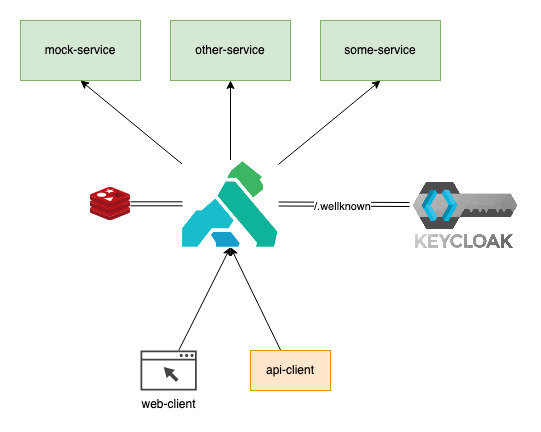

# Kong + OpenID + Keycloak

This is a functional example about how to use Kong opensource distribution with 
[kong-oidc](https://github.com/nokia/kong-oidc) plugin. 

---
**NOTE**

The [kong-oidc](https://github.com/nokia/kong-oidc) plugin is currently unmaintained, being June 2019 the last 
time it was modified. BTW, I've downloaded the plugin files and updated them to accomplish my own needs, adding more
flexibility to session management.
---

## Main flow




We are using [Kong](https://konghq.com/kong/) as our API Gateway, so all request we are going to perform will target 
`localhost:8000/<service-route>`. The [Kong Makefile](kong/Makefile) have an example about how to create a new service 
and attach it to a route. 

**Integration with Keycloak**

The OIDC plugin allows us to use Kong as an independent service to manage user sessions. The integration with Keycloak 
is performed via the `./wellknown` discovery endpoints, also you need to create a new Client to allow Kong make request 
to Keycloak. You'll get more detail about it in the [Configuration](#configuration) section.

When an **unauthenticated** user request for some resource, Kong redirects to the login page. Once the user is 
authenticated, Kong will retrieve the session token and generate a session cookie. Depending on the storage type 
`memcache`|`redis`, the cookie may contain some additional information, but we gonna explain this part in the 
[session management](#session-management) section.

**Making request to the Service API**

Once we have the session cookie, we need to send it on all request we perform to the Kong gateway:
```
GET /mock
Host: localhost:8000
User-Agent: Mozilla/5.0 (Macintosh; Intel Mac OS X 10.15) Firefox/83.0
Accept: text/html,application/xhtml+xml,application/xml;q=0.9,image/webp,*/*;q=0.8
Accept-Language: es-ES,es;q=0.8,en-US;q=0.5,en;q=0.3
Accept-Encoding: gzip, deflate
DNT: 1
Connection: keep-alive
Cookie: MY_COOKIE=uzJlEQaLPoE-zxPceFsH2g|1606851719|O5LCA5pm3NZ5-WH2IqMys8ZiBt4; ajs_anonymous_id=%22248b7323-64cf-4597-8dbe-45599a8f7015%22
Upgrade-Insecure-Requests: 1
```
Kong will be able to read the cookie and attach the token retrieved by Keycloak in the `Authorization` header. The 
backend service will receive a request with a valid auth token.

**Introspection**

If we have a client already authenticated, the client has to send the auth token in the `Authorization` header, so Kong 
will be able to detect and introspect the token with Keycloak. This is a very common case for api-clients.

## Session Management

The OIDC plugin uses the `lua-resty-session` lib to manage sessions. The 
[session-plugin](https://docs.konghq.com/hub/kong-inc/session/) provided by Kong uses the same open-source library, 
but is not compatible to work with the opensource OIDC plugin (works only with enterprise plugins).
You can configure the session lib using `ngnx.conf` files, for this case I added some extra parameters to configure the 
session via oidc plugin. 

The `lua-resty-session` supports multiple storage types, such `memcache`, `redis`, `shm`, `cookie`, `dshm`. For this 
case, I've only added support for `cookie` and `redis`, but you can use it as inspiration to implement the other
storage types. You can find more information about the available configuration options in the 
[official GitHub repository](https://github.com/bungle/lua-resty-session).

**Cookie**

This is the default session storage. Once Keycloak authenticates the user, the authorization token is retrieved along
with the user scopes. This information is encrypted and send to the client as a cookie. The cookie is flagged `HttpOnly`
by default to avoid javascript manipulation. Depending on the JWT size, the cookie could be bigger than 4kb (max cookie
size allowed), so the session lib gonna split the original cookie into little ones (`session`, `session_2`, `session_3`
...). 

Kong doesn't know what's your auth token, so each time you send a request, Kong will decrypt the cookie and get the
token, making the web client the only one responsible for the session storage.

**Redis**

If you want to have total control over the session management, you can store the auth token and other information 
related with the user session into a redis database. The flows still being the same, the only difference is Kong will 
return a cookie containing the session identifier to the browser, with no information about the token/user encrypted.

Once you perform requests, Kong will extract the session identifier and retrieves the auth token from the redis storage,
setting the `Authorization` header.


## Configuration

### Kong
The first time you'll need to run the migrations on the kong-db container before any other. The
[Makefile](Makefile) has a configured rule to start the setup of your environment: `prepare_kong`. It will autoconfigure
the kong-oidc plugin adn make it available for all services.

**Using redis**

In case you want to use `redis` as your session storage, you'll need to add some extra configuration params:
```
config.session_storage=redis
config.session_redis_host=redis
config.session_redis_port=6379
config.session_redis_prefix=session
config.session_redis_socket=<socket>
config.session_redis_host=<host>
config.session_redis_auth=<password>
config.session_redis_server_name=<server>
```
Depending on your needs, those parameters are optional.


### Keycloak
Once the containers are running, you need to start configuring your Keycloak server. The first step is to login
with the default credentials (admin/admin) to the administration console. Then you need to:
- Create Client:
    - Menu `Clients` > click `Create` button
    - Client ID: kong
    - Click `Save` button.
    - In **Settings** tab:
        - Access type: `Confidential`
        - Root URL: `http://localhost:8000`
        - Valid Redirect URL: `/mock/*`
        - Click `Save` button.
    - In **Credentials** tab:
        - Copy the Secret value (You will need it to configure the Kong plugin)

- Create User (optional)
    - Menu `Users` > click `Add user` button
    - Username: user, enable the Email verified switch.
    - Click `Save` button.
    - In **Credentials** tab:
        - Set password, disable the Temporary credentials switch.
        - Click `Reset Password` button.

## Running the example

### Web Browser
Enter to localhost:8000/mock, login into keycloak and you gonna see the final request created by Kong, with the 
auth token injected in the `Authorization` header.

### Java client
Once the infrastructure is configured, you need to setup the Java client with the Oauth parameters to establish
connection with Keycloak. Check the [README](java-oidc-client/README.md) file to get more detail about how to run
this projects and the available endpoints.

## Acknowledgment
This project is inspired by the articles Securing APIs with Kong and Keycloak. Find available the 
[part 1](https://www.jerney.io/secure-apis-kong-keycloak-1/) and 
[part 2](https://www.jerney.io/secure-apis-kong-keycloak-2/).


