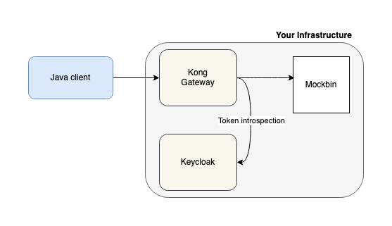

# Kong + OpenID + Keycloak

This is a functional example of how to use Kong opensource distribution with 
[kong-oidc](https://github.com/nokia/kong-oidc) plugin. The main idea is to secure some resource (Mockbin) using 
Keycloak, and make it accessible through Kong gateway. Also, we created an external client to call this resource and 
this is the most interesting part. 

## Basic flow
Once the client is authenticated, it can request for protected resources via Kong gateway. On the other 
side, Kong will verify if the client sent the Authorization token and verify with Keycloak. 
If the token is valid, Kong will allow the request and show the protected resource, otherwise the client will be 
redirected to the login page. This validation is performed by the OIDC plugin, through the token introspection endpoint.

##Configuration

### Kong
The first time you'll need to run the migrations on the kong-db container before any other. The
[Makefile](Makefile) has a configured rule to start the setup of your environment: `prepare_kong`. It will autoconfigure
the kong-oidc plugin adn make it available for all services.

### Keycloak
Once the containers are running, you need to start configuring your Keycloak server. The first step is to login
with the default credentials (admin/admin) to the administration console. Then you need to:
- Create Client:
    - Menu `Clients` > click `Create` button
    - Client ID: kong
    - Click `Save` button.
    - In **Settings** tab:
        - Access type: `Confidential`
        - Root URL: `http://localhost:8000`
        - Valid Redirect URL: `/mock/*`
        - Click `Save` button.
    - In **Credentials** tab:
        - Copy the Secret value (You will need it to configure the Kong plugin)

- Create User (optional)
    - Menu `Users` > click `Add user` button
    - Username: user, enable the Email verified switch.
    - Click `Save` button.
    - In **Credentials** tab:
        - Set password, disable the Temporary credentials switch.
        - Click `Reset Password` button.

## Running the example
### Java client
Once the infrastructure is configured, you need to setup the Java client with the Oauth parameters to establish
connection with Keycloak. Check the [README](java-oidc-client/README.md) file to get more detail about how to run
this projects and the available endpoints.

## Acknowledgment
This project is inspired by the articles Securing APIs with Kong and Keycloak. Fin available the 
[part 1](https://www.jerney.io/secure-apis-kong-keycloak-1/) and 
[part 2](https://www.jerney.io/secure-apis-kong-keycloak-2/).

